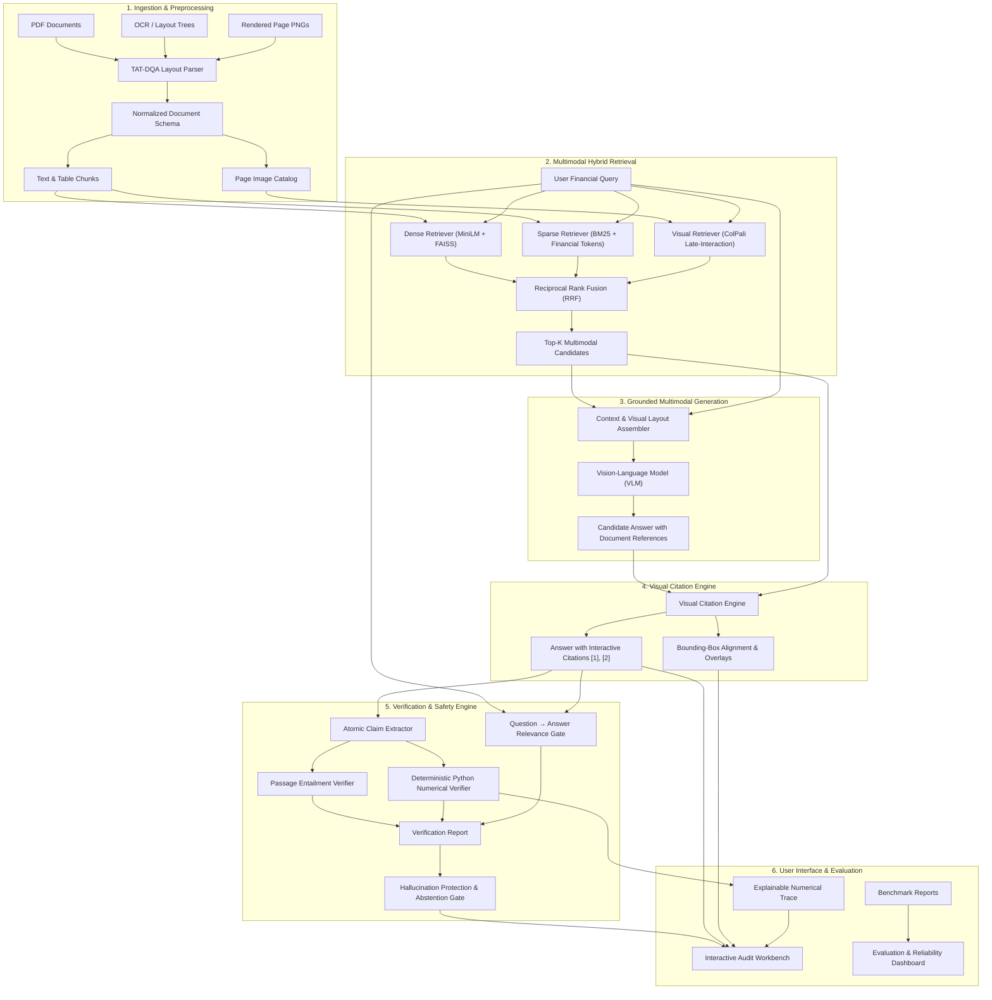

# AuditRAG: System Architecture & Technical Specification

## 1. Executive Summary & Architecture Overview

**AuditRAG** is an audit-grade, multimodal Retrieval-Augmented Generation (RAG) system engineered for complex corporate financial disclosures (e.g., SEC 10-K filings, annual reports, earnings releases from the TAT-DQA dataset). 

Unlike generic text-based RAG pipelines, AuditRAG addresses three core challenges in enterprise financial analysis:
1. **Multimodal Information Density:** Financial reports combine narrative paragraphs, structured balance sheet tables, footnotes, and charts where layout semantics determine meaning.
2. **Numerical Grounding & Arithmetic Precision:** Financial metrics require exact figures and deterministic calculations (percentage growths, variances, ratios) that language models frequently hallucinate.
3. **Auditable Evidence & Factuality Verification:** Corporate auditors require verifiable document citations down to exact page coordinates and layout bounding boxes.

### High-Level System Architecture

---

## 2. Subsystem Details

### 2.1 Ingestion & Normalization (`auditrag/ingestion/`)
- **Parser (`tatdqa_parser.py`):** Ingests hierarchical TAT-DQA JSON structures capturing document pages, layout blocks, word-level OCR tokens, and coordinate bounding boxes `[x0, y0, x1, y1]`.
- **Normalization (`models.py`):** Converts heterogeneous representations into unified Pydantic v2 schemas: `NormalizedDocument`, `NormalizedPage`, `NormalizedBlock`, and `BBox`.
- **Chunking (`retrieval/chunking.py`):** Preserves table rows and contiguous narrative paragraphs, retaining full spatial metadata (`document_id`, `page_number`, `block_uuid`, `bbox`) on every text chunk.

### 2.2 Multimodal Hybrid Retrieval (`auditrag/retrieval/`)
To achieve robust recall across both pure narrative disclosures and complex financial tables, AuditRAG deploys three complementary retrieval modalities:

1. **Dense Semantic Retrieval (`dense.py`):**
   - Embedder: `sentence-transformers/all-MiniLM-L6-v2` (384-dimensional dense vectors).
   - Index: FAISS `IndexFlatIP` with normalized inner-product cosine similarity.
   - Purpose: Disambiguates synonyms, paraphrased financial concepts, and multi-sentence context.
2. **Sparse Lexical Retrieval (`bm25.py`):**
   - Algorithm: Okapi BM25 (`k1=1.5`, `b=0.75`).
   - Tokenization: Specialized regex tokenizer capturing financial tokens, ticker symbols, fiscal years (`2018`, `FY19`), dollar amounts (`$21,224`), and percentages (`25.0%`).
   - Purpose: Zero-shot precision on exact metric names, line-items, and company codes.
3. **Visual Page Retrieval (`colpali.py`):**
   - Model: `vidore/colpali-v1.2` late-interaction vision-language retriever.
   - Mechanism: Operates directly on rendered document page screenshots, encoding visual patches into multi-vector representations scored via late-interaction MaxSim.
   - Purpose: Indexes visual table structure, graphic dividers, headers, and footnotes that text parsers lose.
4. **Reciprocal Rank Fusion (`hybrid.py`):**
   - Fuses ranked lists across modalities using rank-based reciprocal scoring ($k=60$):
     $$RRF(d) = \sum_{m \in M} \frac{w_m}{k + \text{rank}_m(d)}$$
   - Prevents score scale mismatches without requiring manual calibration.

### 2.3 Multimodal Generation (`auditrag/generation/`)
- **Generator (`vlm.py`):** Formulates grounded prompts anchoring the generator strictly to retrieved context.
- **Providers:**
  - `OpenAIVLMProvider`: Integrates with GPT-4o Vision for live multimodal reasoning.
  - `MockVLMProvider`: Deterministic offline provider for test reproducibility and zero-cost CI benchmarking.

### 2.4 Interactive Visual Citation Engine (`auditrag/citations/`)
- **Alignment (`bounding_box.py`):** Resolves claim citations `[1]`, `[2]` to exact document pages and layout block coordinates.
- **Visualizer (`visualizer.py`):** Dynamically composites high-contrast amber/red translucent bounding-box overlays over high-resolution document page images.
- **Interactive UI (`ui/citation_viewer.py`):** Supports multi-citation switching, bounding-box coordinate inspection, and 4 display modes (full-page overlay, focused citation highlight, unannotated original, and side-by-side comparison).

### 2.5 Verification & Hallucination Protection Engine (`auditrag/verification/`)
AuditRAG does not rely on language model self-evaluation. It applies deterministic, multi-stage factuality and relevance gates:

1. **Atomic Claim Extraction (`claim_extractor.py`):** Parses generated responses into atomic verifiable claims, categorizing each as `TEXTUAL`, `NUMERICAL`, or `CALCULATION`.
2. **Evidence Grounding (`evidence_verifier.py`):** Verifies each atomic claim against retrieved passages via token containment and NLI entailment scoring.
3. **Deterministic Numerical Verification (`numerical_verifier.py`):**
   - Executes independent Python arithmetic for percentage growth, variances, differences, and summations.
   - For percentage growth: $\left(\frac{\text{New} - \text{Old}}{|\text{Old}|}\right) \times 100\%$.
   - For variances: $\text{End} - \text{Start} = \text{Variance}$.
   - For sums: $\sum \text{Components} = \text{Total}$.
4. **Question-Answer Relevance Gate (`relevance_verifier.py`):**
   - Deterministically checks if the extracted facts actually answer the metric requested by the user.
   - Prevents accepting factually true disclosures about the *wrong metric* (e.g., answering with depreciation when asked for total assets).
5. **Principled Abstention (`abstention.py`):**
   - Evaluates factual consistency scores and gate decisions.
   - Triggers clean abstention (`"I couldn't verify this answer from the available document evidence."`) when evidence is ungrounded (`INSUFFICIENT_EVIDENCE`), off-topic (`IRRELEVANT_ANSWER`), or mathematically inconsistent (`FAILED_ARITHMETIC_CHECK`).

### 2.6 Evaluation & Reliability Dashboard (`auditrag/ui/dashboard.py`)
- Renders pre-computed, version-controlled benchmark artifacts (`reports/tables/`, `reports/figures/`) without recalculation.
- Displays retrieval benchmarks across all 4 modalities, answer quality (EM, F1, Numeric Match), claim factuality breakdown, and the three-stage engineering evolution (Baseline → Improved Grounding → Relevance Gate).

---

## 3. Key Technical Decisions & Design Trade-offs

| Design Decision | Alternative Considered | Selected Rationale |
|:---|:---|:---|
| **Reciprocal Rank Fusion (RRF)** | Learned dense-sparse cross-attention fusion | RRF requires zero training data, eliminates score normalization artifacts across disparate models (cosine vs BM25 vs MaxSim), and is fully deterministic. |
| **Late-Interaction Visual Embeddings (ColPali)** | Traditional OCR text extraction only | Financial tables and footnotes frequently lose structural alignment during flat OCR; ColPali retains multi-vector spatial patch attention. |
| **Deterministic Python Arithmetic** | LLM Chain-of-Thought (CoT) prompting | LLM CoT is non-deterministic and susceptible to calculation hallucinations; isolated Python evaluation provides 100% auditable mathematical truth. |
| **Explicit Relevance Gate** | Pure Claim-to-Evidence verification | Factually grounded answers can still hallucinate relevance (answering the wrong metric); the relevance gate prevents certifying off-topic facts. |
| **Principled Selective Abstention** | Forced generation with disclaimer | In financial compliance and auditing, certifying an incorrect or off-topic figure carries extreme liability; abstaining with a clear audit trail is preferred. |

---

## 4. Portability & Repository Specifications

- **Root Resolution:** All file paths resolve dynamically via `auditrag.config.PROJECT_ROOT` and `pathlib.Path`.
- **Operating Modes:** Supports offline deterministic execution with `MockVLMProvider` and optional live multimodal execution with `gpt-4o`.
- **Threading Safeguards:** Strictly enforces single-threaded BLAS/OMP operations (`torch.set_num_threads(1)`) to guarantee stability on macOS and Linux environments.
